# Дипломная работа. Отказоустойчивая инфраструктура в Yandex Cloud. Гришин Д.А

Инфраструктура развёрнута в Yandex Cloud через Terraform (создание ресурсов) и
Ansible (настройка ВМ). Реализована балансировка нагрузки, мониторинг (Zabbix),
сбор логов (Elasticsearch + Kibana + Filebeat) и ежедневные снапшоты.

ВМ:
- bastion - вход по SSH, внешний IP
- web-a / web-b - nginx, разные зоны, без внешних IP
- zabbix - мониторинг, внешний IP
- elastic - хранилище логов, без внешнего IP
- kibana - просмотр логов, внешний IP

---

### Инфраструктура (Terraform)
- Создаёт сеть, подсети, NAT, группы безопасности, 6 ВМ, балансировщик и снапшоты - 27 ресурсов.
- Inventory для Ansible генерируется автоматически.

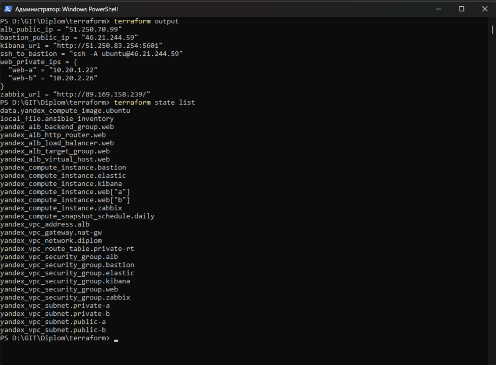

---

### Сеть
- Одна VPC, две публичные и две приватные подсети.
- Группы безопасности открывают только нужные порты.
- NAT-шлюз для выхода приватных ВМ в интернет.

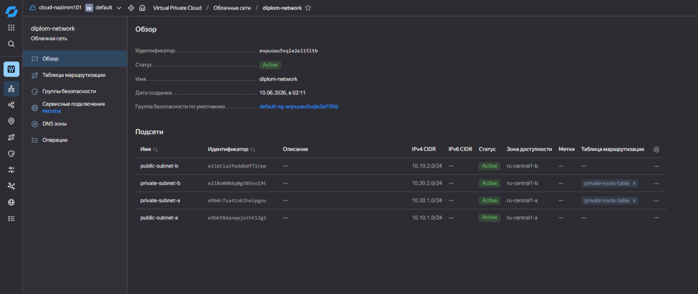
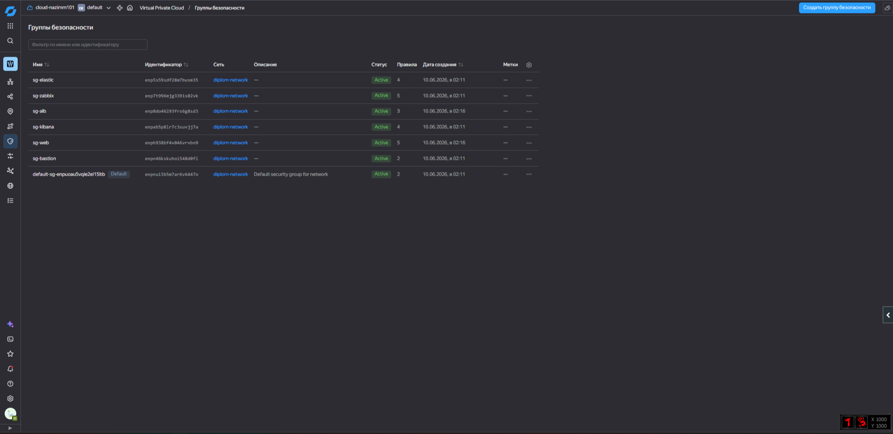

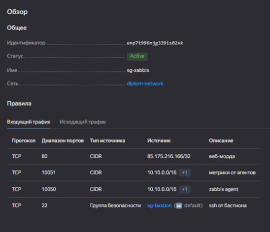
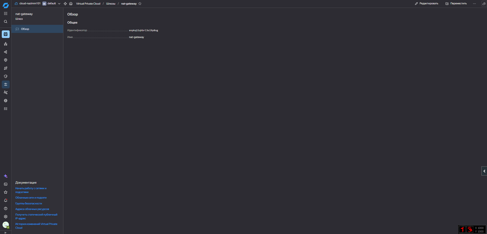
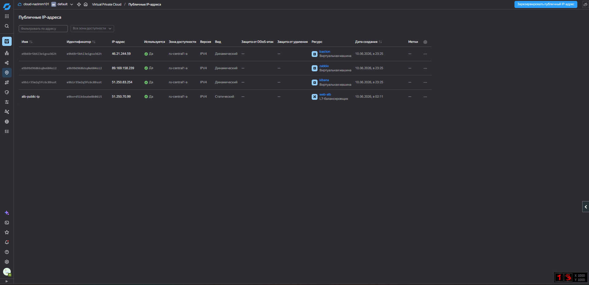

---

### Настройка серверов (Ansible)
- nginx, Docker, Elasticsearch, Kibana, Filebeat, Zabbix-сервер и агенты.
- Пароль БД Zabbix зашифрован через ansible-vault (Для безопасности).

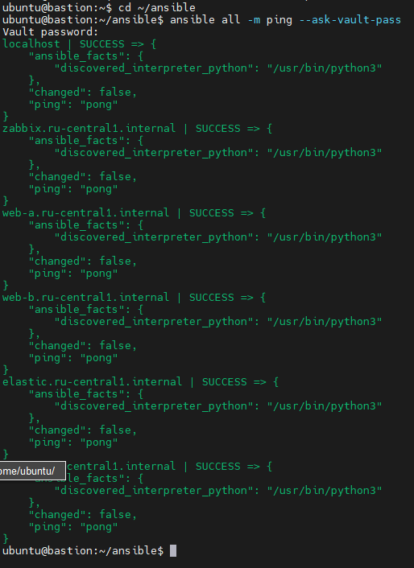

---

### Сайт
- Два nginx-сервера в разных зонах, без внешних IP.
- Доступ по SSH через бастион, к сайту - через балансировщик.
- При обновлении страницы отвечает то web-a, то web-b.

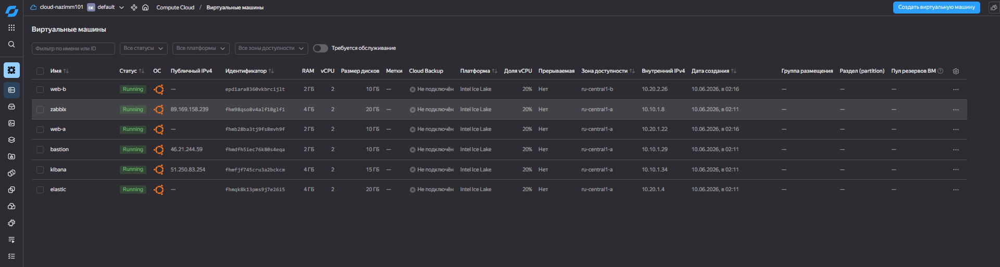
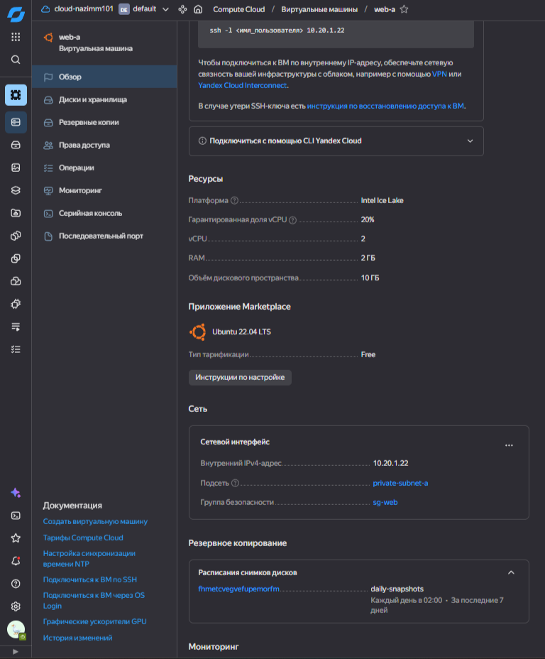
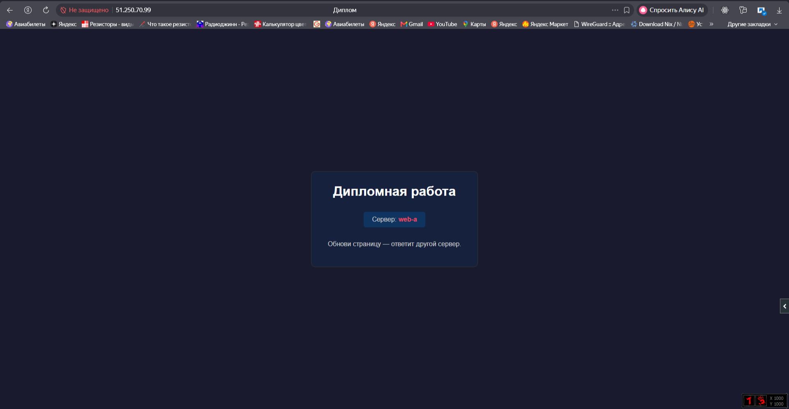
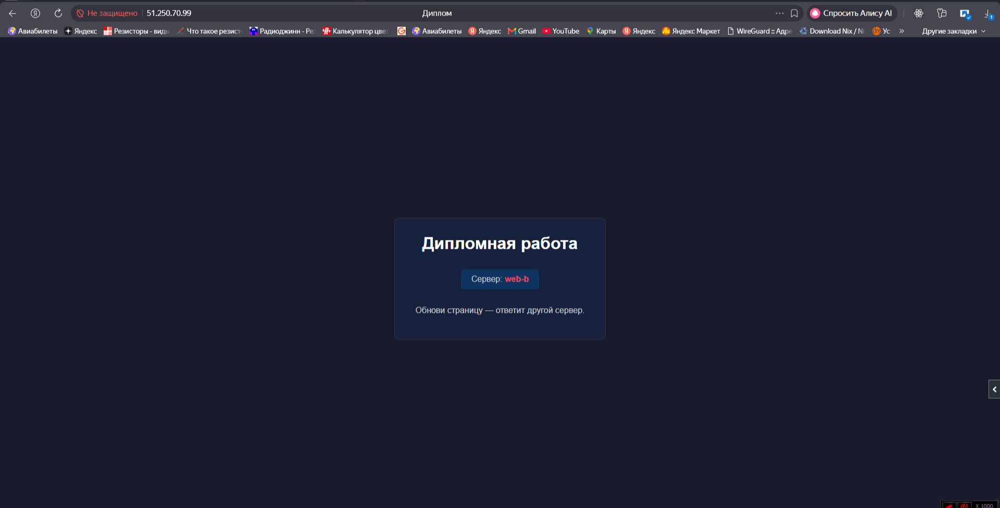

---

### Балансировщик
- Target Group (web-a, web-b) -> Backend Group (порт 80, healthcheck `/`) -> HTTP Router (путь `/`) -> ALB (listener на 80).

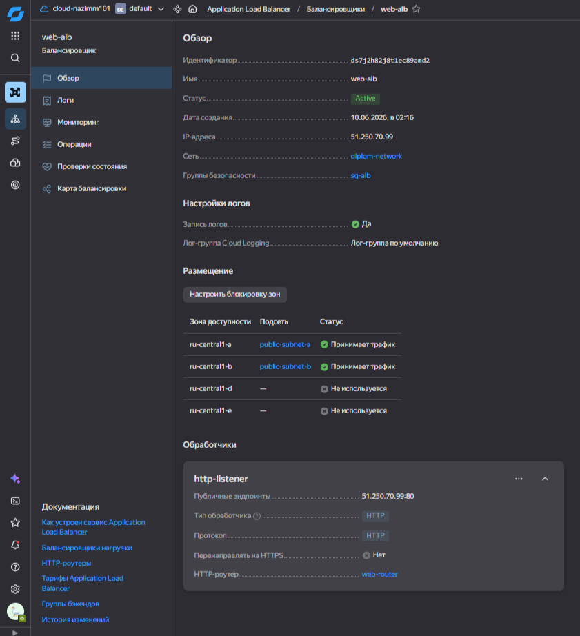
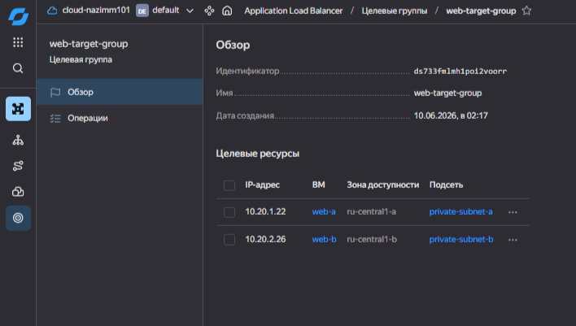
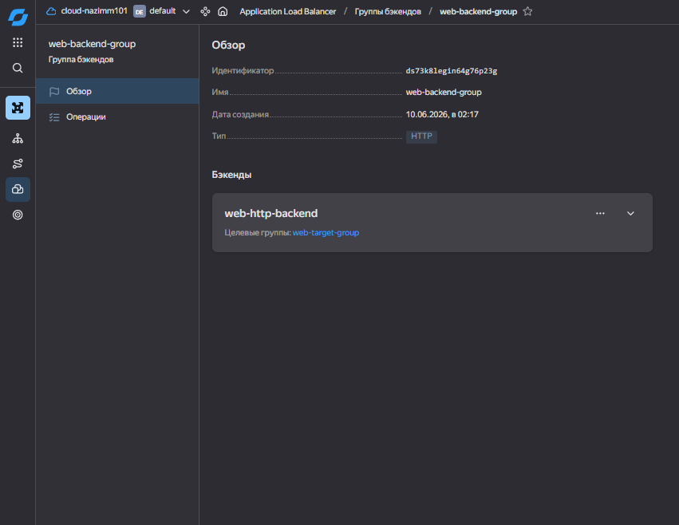
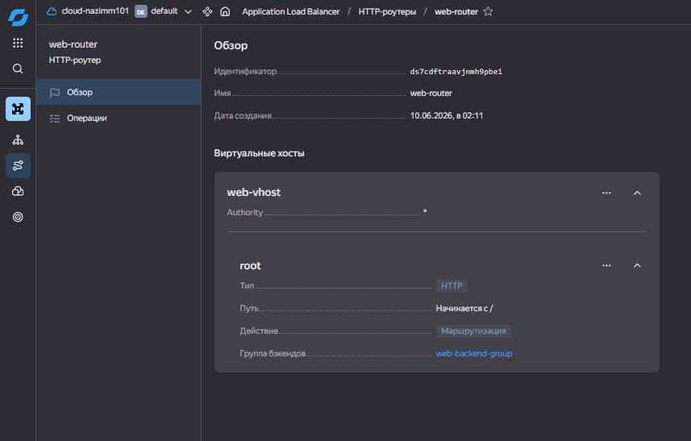

---

### Мониторинг (Zabbix)
- Сервер в Docker, агенты на всех ВМ.
- Дашборд по методу USE: CPU, RAM, диск, сеть, с порогами.

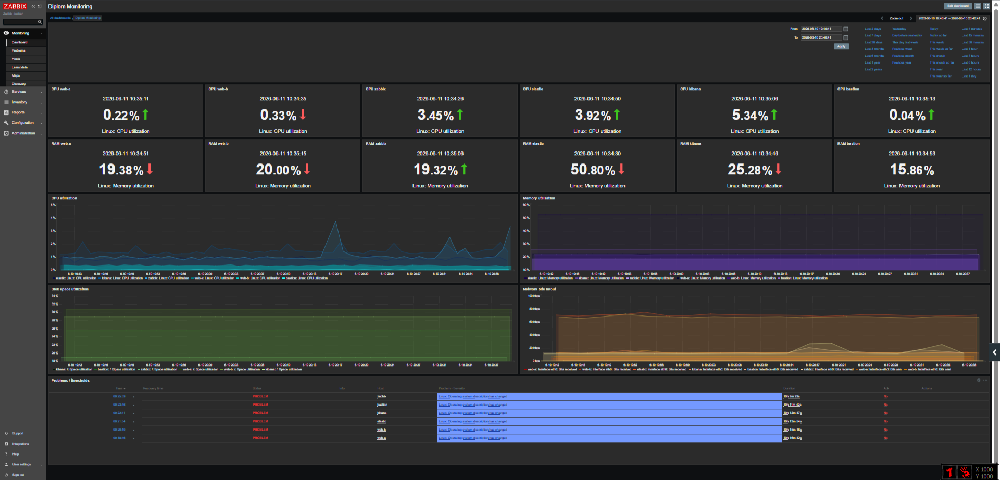

---

### Логирование (Elasticsearch + Kibana + Filebeat)
- Filebeat на веб-серверах отправляет логи nginx в Elasticsearch, Kibana их показывает.

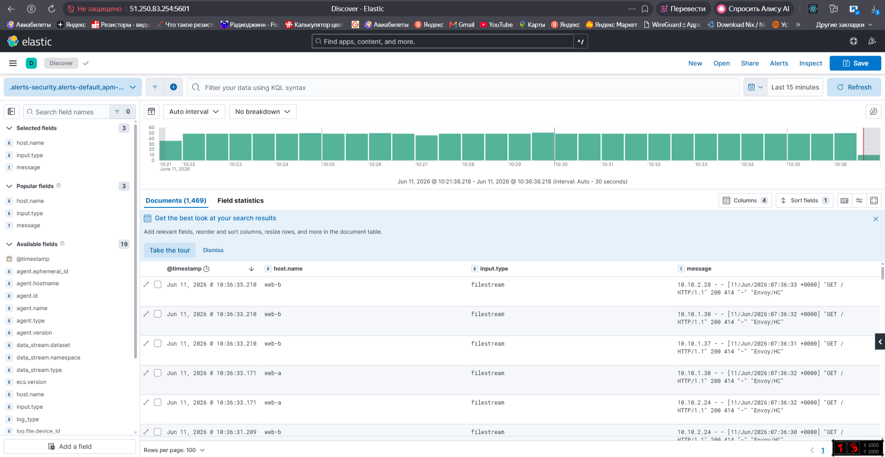

---

### Резервное копирование
- Снапшоты дисков всех ВМ ежедневно в 02:00, хранятся 7 дней.

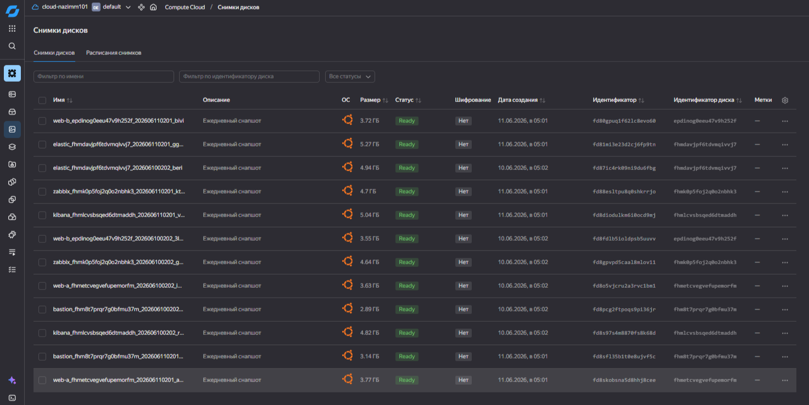

---

Вход в веб-морды Kibana и Zabbix разрешён только с моего белого IP. В принципе можно было ещё сделать проброс по SSH - так даже понадёжнее.
